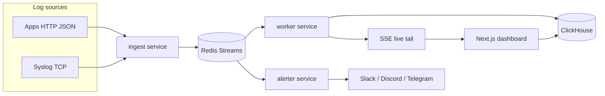

# LogPulse

Real-time log viewer and alert bot: Go ingest and alert engine, Redis Streams buffering, ClickHouse storage, live Next.js dashboard, and Slack / Discord / Telegram notifications.

Built as a portfolio-grade monorepo with tests, CI, and one-command local deployment.

## Architecture



### Why this stack

| Component | Choice | Rationale |
|-----------|--------|-----------|
| Ingest + alerts | Go | Small binaries, strong concurrency, simple deployment |
| Buffer | Redis Streams | Durable fan-out with consumer groups for worker vs alerter |
| Storage | ClickHouse | Fast columnar search over high-volume logs |
| Dashboard | Next.js + SSE | Simple live tail without operating a separate WS cluster |
| Rules | YAML file | Git-friendly, reviewable alert config (DB-backed rules later) |

## Repository layout

```
services/ingest/     HTTP + syslog → Redis Streams
services/worker/     Stream consumer → ClickHouse + SSE fan-out
services/alerter/    Stream consumer → rule engine → webhooks
services/agent/      File-tail forwarder → ingest
services/mockwebhook/ CI webhook receiver (not run in default compose)
web/                 Next.js dashboard
deploy/              ClickHouse init, default alert rules, CI overlays
scripts/             log-generator.sh, e2e-smoke.sh
docker-compose.yml   Full local stack (+ docker-compose.ci.yml for CI)
```

## Quickstart

**Requirements:** Docker, Docker Compose, optional Go 1.22+ and Node 22+ for native dev.

```bash
cp .env.example .env
docker compose up --build
```

| URL | Service |
|-----|---------|
| http://localhost:3000 | Dashboard |
| http://localhost:8080 | Ingest HTTP |
| http://localhost:8081 | Worker (SSE + search API) |
| tcp://localhost:5514 | Syslog ingest |

Generate sample logs:

```bash
./scripts/log-generator.sh
```

Tail a file into the pipeline:

```bash
docker compose up -d ingest
go run ./services/agent --file /var/log/myapp.log --service myapp
```

Open the **Live tail** page, filter by level/service, pause/resume, then use **Search** for stored history and **Alert rules** to inspect `deploy/alerts.yaml`.

## Configuration

See [`.env.example`](.env.example). Important variables:

- `REDIS_ADDR` — Redis for all Go services (local Compose)
- `REDIS_URL` — Redis connection URL (TLS/password); used by Render Key Value and Neon-style setups. Takes precedence over `REDIS_ADDR` when set.
- `CLICKHOUSE_DSN` — Worker storage when `STORAGE_BACKEND=clickhouse` (default local stack)
- `DATABASE_URL` — Postgres connection string when `STORAGE_BACKEND=postgres` (Neon: include `sslmode=require`)
- `STORAGE_BACKEND` — `clickhouse` (default) or `postgres`
- `INGEST_API_KEY` — When set, `POST /v1/logs` requires `Authorization: Bearer <key>` (syslog unchanged)
- `READ_API_KEY` — When set, worker read APIs (`/v1/live`, `/v1/logs/search`) require the same bearer header
- `INGEST_SYSLOG_ADDR` — TCP syslog listen address; leave empty to disable syslog (default for unset env in ingest/all)
- `LOG_RETENTION_HOURS` — Postgres TTL job interval (default `168`)
- `ALERT_RULES_PATH` — YAML rules for alerter
- `SLACK_WEBHOOK_URL`, `DISCORD_WEBHOOK_URL`, `TELEGRAM_BOT_TOKEN`, `TELEGRAM_CHAT_ID` — optional notification targets
- `WORKER_URL` — Server-side backend base URL for the Next.js dashboard proxy (Vercel: your Render service URL)
- `READ_API_KEY` — Set on Vercel only (never `NEXT_PUBLIC_*`); the proxy adds `Authorization` when calling the worker
- `NEXT_PUBLIC_WORKER_URL` / `NEXT_PUBLIC_INGEST_URL` — Optional direct browser bases (local dev without proxy)

## Ingest API

### `POST /v1/logs`

Accepts a JSON batch (max 1000 entries).

```json
{
  "logs": [
    {
      "timestamp": "2026-09-29T12:00:00Z",
      "level": "error",
      "service": "payments",
      "message": "charge failed",
      "attributes": { "order_id": "ord_123" }
    }
  ]
}
```

- **Levels:** `debug`, `info`, `warn`, `error`, `fatal`
- **Responses:** `202 Accepted` on success; `400` on validation errors

### Syslog

Send RFC5424-style lines to TCP `:5514`. The ingest service maps application name and message into `service` and `message`, with coarse level inference from keywords.

### Health

- Ingest: `GET /healthz`
- Worker: `GET /healthz`, `GET /v1/live` (SSE), `GET /v1/logs/search?q=&level=&service=&limit=`
- Alerter: `GET /healthz`

## Alert rules

Rules live in YAML (default: [`deploy/alerts.yaml`](deploy/alerts.yaml)).

```yaml
rules:
  - id: error-burst
    name: Error burst
    enabled: true
    level: error
    window: 1m          # Go duration string
    threshold: 50       # events in window
    cooldown: 5m        # suppress repeat notifications
    channels: [slack, discord]

  - id: panic-pattern
    name: Panic detected
    enabled: true
    pattern: "panic:"   # regex on message
    window: 1m
    cooldown: 15m
    channels: [slack, telegram]
```

The alerter applies **sliding time windows**, **deduplication** by rule/service/message fingerprint, and **cooldown** so one incident does not spam channels.

## Development

```bash
go work sync
go test ./pkg/logevent ./pkg/alertengine
go test ./services/ingest/...
go test ./services/worker/...
go test ./services/alerter/...
go test ./services/agent/...

cd web && npm install && npm test && npm run lint
```

### End-to-end smoke (Docker)

Same check CI runs after bringing up the stack with the CI overlay (mock webhook + smoke alert rule):

```bash
docker compose -f docker-compose.yml -f docker-compose.ci.yml up --build -d
./scripts/e2e-smoke.sh
docker compose -f docker-compose.yml -f docker-compose.ci.yml down -v
```

The smoke script posts HTTP and syslog events, asserts ClickHouse search and the worker SSE stream receive them, and verifies the alerter delivers a webhook to `mockwebhook`.

See [CONTRIBUTING.md](CONTRIBUTING.md) for branch naming (`feat/*`, `fix/*`), Conventional Commits, and trunk-based workflow on `main`.

## Free deployment

Run the **dashboard on Vercel** ([`web/`](web/)) and a **single Render free web service** for ingest, stream worker, live SSE, search, and alerts. Redis is [Render Key Value](https://render.com/docs/key-value); log storage is **Postgres** (e.g. [Neon free](https://neon.tech)) because ClickHouse has no practical free host.

### Render (backend)

1. Create a free Postgres database (Neon) and copy the connection string (`sslmode=require`).
2. Apply the repo [`render.yaml`](render.yaml) blueprint (region **Singapore**, plan **free**) or create a **Docker** web service from [`Dockerfile.render`](Dockerfile.render).
3. Add a free **Key Value** instance and wire `REDIS_URL` (blueprint links `logpulse-redis` automatically).
4. Set environment variables:

| Variable | Value |
|----------|--------|
| `STORAGE_BACKEND` | `postgres` |
| `DATABASE_URL` | Neon URL (`postgresql://…?sslmode=require`) |
| `REDIS_URL` | Render Key Value internal URL |
| `INGEST_API_KEY` | Strong random secret (ingest clients / agents) |
| `READ_API_KEY` | Strong random secret (dashboard proxy only) |
| `WORKER_CORS_ORIGINS` | `https://logpulse-web-seven.vercel.app` (your Vercel URL) |
| `LOG_RETENTION_HOURS` | `168` (or lower to stay under ~0.5 GB) |
| `SLACK_WEBHOOK_URL` / `DISCORD_WEBHOOK_URL` / `TELEGRAM_*` | Optional alert channels |

Render sets `PORT`; the all-in-one binary listens on `0.0.0.0:$PORT`. Syslog is off unless you set `INGEST_SYSLOG_ADDR`.

Health check path: `/healthz`.

### Vercel (dashboard)

| Variable | Value |
|----------|--------|
| `WORKER_URL` | `https://<your-render-service>.onrender.com` |
| `READ_API_KEY` | Same value as Render `READ_API_KEY` |

The dashboard calls `/api/worker/live` and `/api/worker/search` on Vercel; those **server routes** attach the bearer token so the key is not exposed to browsers. Do not set `NEXT_PUBLIC_READ_API_KEY`.

For log shipping from apps, `POST https://<render>/v1/logs` with `Authorization: Bearer <INGEST_API_KEY>`.

Local docker-compose remains the default **ClickHouse** stack; set `STORAGE_BACKEND=postgres` and `DATABASE_URL` only when testing the free path.

## CI / releases

- **CI** (`.github/workflows/ci.yml`): Go tests (auth, Redis URL parsing, Postgres storage integration), web lint/test, **all-in-one smoke** (Redis + Postgres), and Docker Compose **e2e smoke** on pull requests.
- **Release** (`.github/workflows/release.yml`): [release-please](https://github.com/googleapis/release-please) creates version tags from Conventional Commits on `main`.

## Roadmap

- [x] File-tail agent binary (`services/agent`)
- [ ] Rule management UI with validation and dry-run
- [ ] OpenTelemetry export from ingest
- [ ] Multi-tenant API keys and retention policies
- [x] Render blueprint + all-in-one backend for free hosting

## License

MIT (add a LICENSE file before public distribution if required by your org).
