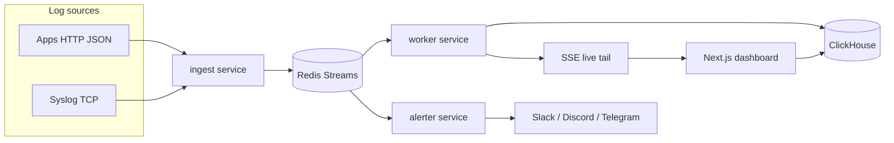

# LogPulse

Real-time log viewer and alert bot: Go ingest and alert engine, Redis Streams buffering, ClickHouse storage, live Next.js dashboard, and Slack / Discord / Telegram notifications.

Built as a portfolio-grade monorepo with tests, CI, and one-command local deployment.

## Architecture



### Why this stack

| Component | Choice | Rationale |
|-----------|--------|-----------|
| Ingest + alerts | Go | Small binaries, strong concurrency, simple deployment |
| Buffer | Redis Streams | Durable fan-out with consumer groups for worker vs alerter |
| Storage | ClickHouse | Fast columnar search over high-volume logs |
| Dashboard | Next.js + SSE | Simple live tail without operating a separate WS cluster |
| Rules | YAML file | Git-friendly, reviewable alert config (DB-backed rules later) |

## Repository layout

```
services/ingest/     HTTP + syslog → Redis Streams
services/worker/     Stream consumer → ClickHouse + SSE fan-out
services/alerter/    Stream consumer → rule engine → webhooks
services/agent/      Planned file-tail agent (see README there)
web/                 Next.js dashboard
deploy/              ClickHouse init, default alert rules
scripts/             log-generator.sh demo script
docker-compose.yml   Full local stack
```

## Quickstart

**Requirements:** Docker, Docker Compose, optional Go 1.22+ and Node 22+ for native dev.

```bash
cp .env.example .env
docker compose up --build
```

| URL | Service |
|-----|---------|
| http://localhost:3000 | Dashboard |
| http://localhost:8080 | Ingest HTTP |
| http://localhost:8081 | Worker (SSE + search API) |
| tcp://localhost:5514 | Syslog ingest |

Generate sample logs:

```bash
./scripts/log-generator.sh
```

Open the **Live tail** page, filter by level/service, pause/resume, then use **Search** for stored history and **Alert rules** to inspect `deploy/alerts.yaml`.

## Configuration

See [`.env.example`](.env.example). Important variables:

- `REDIS_ADDR` — Redis for all Go services
- `CLICKHOUSE_DSN` — Worker storage (default `clickhouse://default:@clickhouse:9000/default`)
- `ALERT_RULES_PATH` — YAML rules for alerter
- `SLACK_WEBHOOK_URL`, `DISCORD_WEBHOOK_URL`, `TELEGRAM_BOT_TOKEN`, `TELEGRAM_CHAT_ID` — optional notification targets
- `NEXT_PUBLIC_WORKER_URL` / `NEXT_PUBLIC_INGEST_URL` — Browser-facing API bases

## Ingest API

### `POST /v1/logs`

Accepts a JSON batch (max 1000 entries).

```json
{
  "logs": [
    {
      "timestamp": "2026-09-29T12:00:00Z",
      "level": "error",
      "service": "payments",
      "message": "charge failed",
      "attributes": { "order_id": "ord_123" }
    }
  ]
}
```

- **Levels:** `debug`, `info`, `warn`, `error`, `fatal`
- **Responses:** `202 Accepted` on success; `400` on validation errors

### Syslog

Send RFC5424-style lines to TCP `:5514`. The ingest service maps application name and message into `service` and `message`, with coarse level inference from keywords.

### Health

- Ingest: `GET /healthz`
- Worker: `GET /healthz`, `GET /v1/live` (SSE), `GET /v1/logs/search?q=&level=&service=&limit=`
- Alerter: `GET /healthz`

## Alert rules

Rules live in YAML (default: [`deploy/alerts.yaml`](deploy/alerts.yaml)).

```yaml
rules:
  - id: error-burst
    name: Error burst
    enabled: true
    level: error
    window: 1m          # Go duration string
    threshold: 50       # events in window
    cooldown: 5m        # suppress repeat notifications
    channels: [slack, discord]

  - id: panic-pattern
    name: Panic detected
    enabled: true
    pattern: "panic:"   # regex on message
    window: 1m
    cooldown: 15m
    channels: [slack, telegram]
```

The alerter applies **sliding time windows**, **deduplication** by rule/service/message fingerprint, and **cooldown** so one incident does not spam channels.

## Development

```bash
go work sync
go test ./pkg/logevent ./pkg/alertengine
go test ./services/ingest/...

cd web && npm install && npm test && npm run lint
```

See [CONTRIBUTING.md](CONTRIBUTING.md) for branch naming (`feat/*`, `fix/*`), Conventional Commits, and trunk-based workflow on `main`.

## CI / releases

- **CI** (`.github/workflows/ci.yml`): Go tests and web lint/test on pull requests and pushes to `main`.
- **Release** (`.github/workflows/release.yml`): [release-please](https://github.com/googleapis/release-please) creates version tags from Conventional Commits on `main`.

## Roadmap

- [ ] File-tail agent binary (`services/agent`)
- [ ] Rule management UI with validation and dry-run
- [ ] OpenTelemetry export from ingest
- [ ] Multi-tenant API keys and retention policies
- [ ] Helm chart / Render blueprint for production deploy

## License

MIT (add a LICENSE file before public distribution if required by your org).
